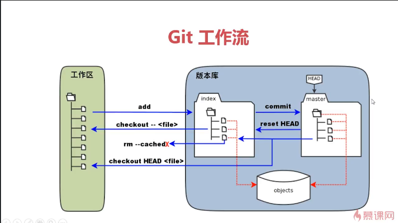

初始化目录(工作区)
	
	git init

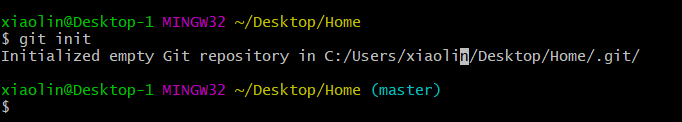

创建文件夹

	mkdir MyGit
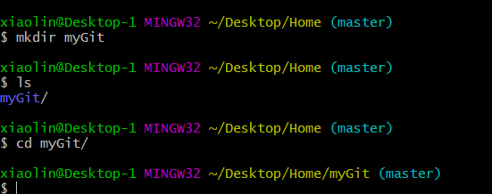

创建文件
		
	touch README.md
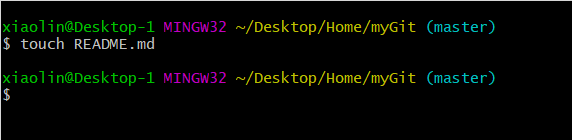

查看状态

	git status

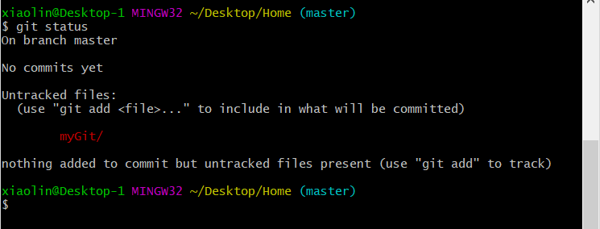

添加文件到暂存区

	git add README.md

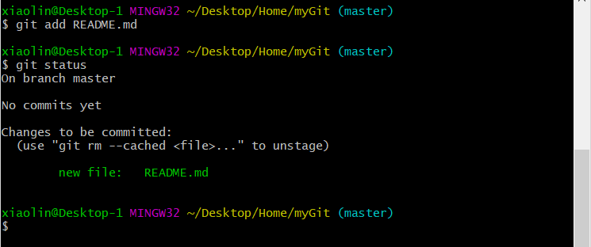

提交到master默认分支

	git commit -m "add README.md 2018/10/28 20:44:24 "

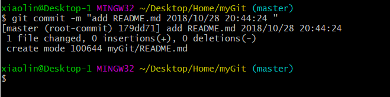
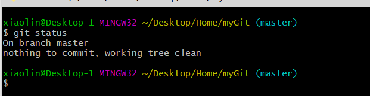

新增文件时
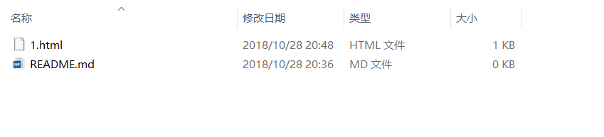
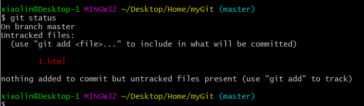

将新文件添加并提交

	git add 1.html
	git commit -m "1.html commit 2018/10/28 20:53:13 "
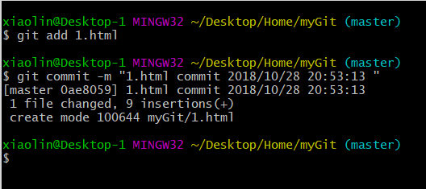

修改1.html文件，向文本追加

	echo "<--这是一段注释 version 1.0-->" >> 1.html

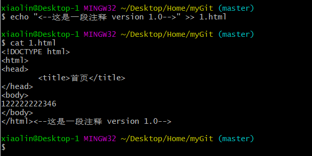

查看状态

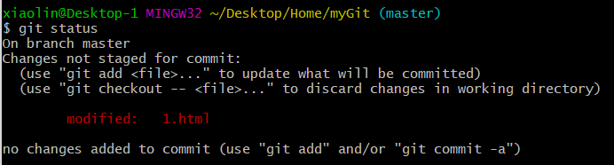

添加到暂存区

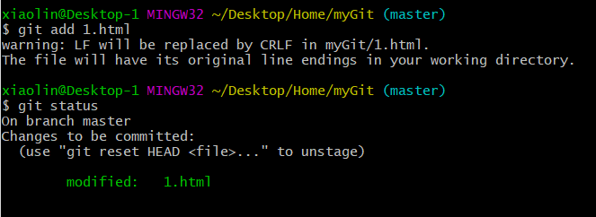

恢复到未添加注释的1.html文件

首先把1.html从暂存区恢复工作区

	git reset HEAD 1.html
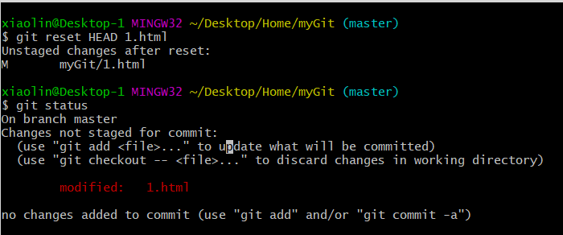

然后在工作区检出

	git checkout -- 1.html

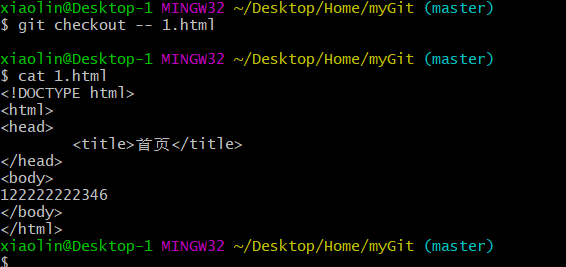

恢复到只有README.md文件的时候

	git log

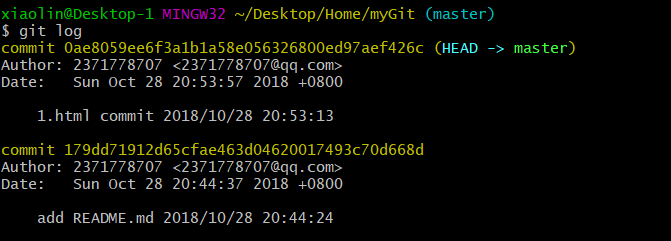

复制 commit后面的序列号

	git reset --hard 179dd71912d65cfae463d04620017493c70d668d

Date 一行是系统记录生成的时间

根据时间或者备注可以知道，第一次提交的序列号

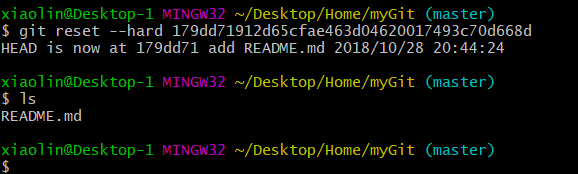

清空本地仓库

	git rm README.md

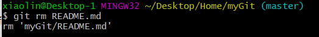

	git commit -m "delete myGit"

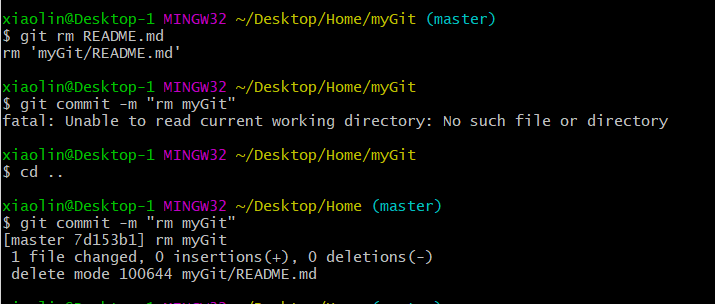
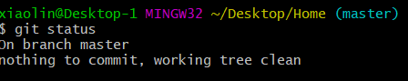
